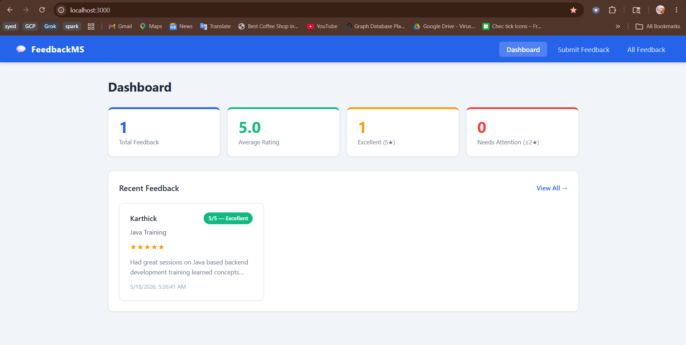
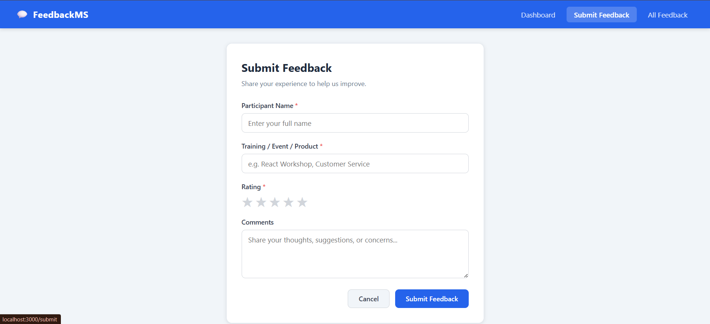
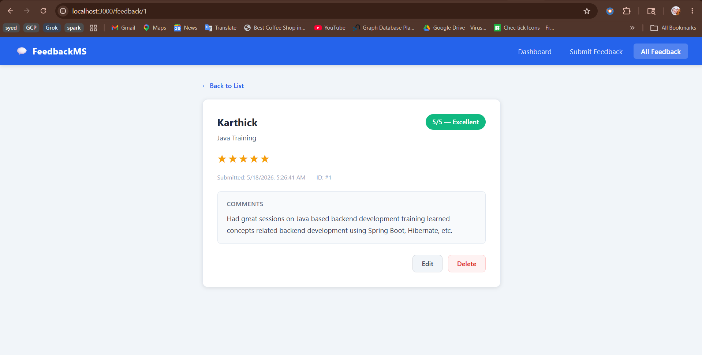

# Feedback Management System — Phase 1

A full-stack web application for centralized feedback collection and management.

## Tech Stack

| Layer | Technology |
|-------|-----------|
| Frontend | React 18, React Router v6, Axios |
| Backend | Python FastAPI |
| Database | SQLite (via SQLAlchemy) |

## Project Structure

```
FeedbackMS/
├── backend/
│   ├── main.py          # FastAPI app + CORS
│   ├── database.py      # SQLite engine & session
│   ├── models.py        # SQLAlchemy ORM model
│   ├── schemas.py       # Pydantic request/response schemas
│   ├── crud.py          # Database CRUD operations
│   ├── routers/
│   │   └── feedback.py  # API route handlers
│   └── requirements.txt
└── frontend/
    ├── public/
    │   └── index.html
    └── src/
        ├── api.js                     # Axios base config
        ├── App.js                     # Router setup
        ├── components/
        │   ├── Navbar.jsx
        │   └── FeedbackCard.jsx
        ├── pages/
        │   ├── Dashboard.jsx          # Stats + recent feedback
        │   ├── SubmitFeedback.jsx     # Submit form
        │   ├── FeedbackList.jsx       # All feedback + search/filter
        │   └── FeedbackDetail.jsx     # View / edit / delete
        └── services/
            └── feedbackService.js     # API call helpers
```

## Setup & Installation

### Backend

```bash
cd backend
pip install -r requirements.txt
uvicorn main:app --reload
```

Backend runs at: http://localhost:8000  
API docs (Swagger): http://localhost:8000/docs

### Frontend

```bash
cd frontend
npm install
npm start
```

Frontend runs at: http://localhost:3000

## API Reference

| Method | Endpoint | Description |
|--------|----------|-------------|
| GET | /api/feedback | Get all feedback |
| GET | /api/feedback/{id} | Get feedback by ID |
| POST | /api/feedback | Submit new feedback |
| PUT | /api/feedback/{id} | Update feedback |
| DELETE | /api/feedback/{id} | Delete feedback |
| GET | /api/search | Search / filter feedback |

### Search Query Parameters

- `keyword` — searches participant name, program, comments
- `rating` — filter by exact rating (1–5)
- `program_name` — filter by program/event name

## Database Schema

**feedback** table

| Column | Type | Notes |
|--------|------|-------|
| feedback_id | INTEGER | Primary key, auto-increment |
| participant_name | VARCHAR(100) | Not null |
| program_name | VARCHAR(200) | Not null |
| rating | INTEGER | 1–5, not null |
| comments | TEXT | Optional |
| submitted_at | DATETIME | Auto-set on insert |

## Screenshots

### Dashboard


### Submit Feedback


### All Feedback


## Features

- Submit feedback with name, program, rating (1–5 stars), and comments
- Dashboard with total count, average rating, and recent entries
- View all feedback with live search + filter by keyword, rating, and program
- Full feedback detail view with inline edit and delete confirmation modal
- Responsive design — works on desktop and mobile
